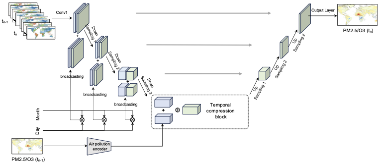

# APForecaster
This GitHub repository is for the under-review paper "Climate Change Impact on Future Landscape Fire Air Pollution and Global Mortality Burden". 

## Pipeline

  
 

## Requirements
### Installation
Please refer to the requirements.txt file. All the packages as well as versions have been provided.

### Data Preparation
Please refer to the manuscript for details. Here, we only provide data for casual model testing and project global LFS-derived fine particulate matter (PM2.5) and ozone (O3) from 2020 to 2100.

## Model Training
 before training and testing, please update the configs. Generally, we train the model with three 40 GB memory GPUs. 
 ~~~~~~~~~~~~~~~~~~
   python main.py 
 ~~~~~~~~~~~~~~~~~~

## Model Testing

